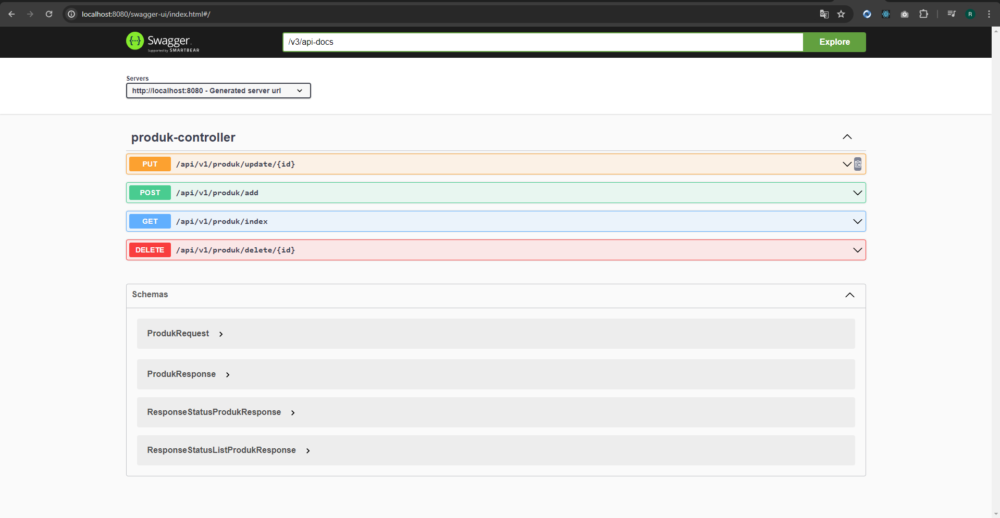

## Spring boot - Simple CURD API With MariaDB & Swagger

## System Requirements
- Java openjdk : ( version "11.0.18")
- Spring Boot : (version 2.7.11)
- MariaDB : (Version 10.4.28)
- Maven : (Apache Maven 3.9.1)
- Editor : (Intellij IDEA 2023.1.1 Community Edition)


## run project

1. clone project Spring boot - Simple CURD API With Swagger
```
git clone https://github.com/rname97/curd-api.git
```

2. add new database mysql with name "db_curd_api"

3. open project with intellij IDEA then edit config database in application.properties change username and password match your config db

4. open terminal input command 
```
mvn clean install 
```
5. if success next input command 
```
mvn spring-boot:run
```

6. open your browser input url 
``` 
http://localhost:8080/swagger-ui/index.html#/ 
```


## Add Data Product
This is API endpoint as a create new data product

### Request URL
```
- POST http://localhost:8080/api/v1/produk/add
```

### Request body
```json
{
    "produkName": "ayam goreng",
    "produkHarga": 1000,
    "produkKategori": "makanan",
    "produkStok": 5
}
```

### Response
```json
{
  "status": true,
  "statusCode": "OK",
  "message": [
    "Berhasil Menambahkan Data Product"
  ],
  "data": {
    "id": 3,
    "produkName": "ayam goreng",
    "produkHarga": 1000,
    "produkKategori": "makanan",
    "produkStok": 5
  }
}
```


## Get List Data Product
This is API endpoint as a get List all data product

### Request URL
```
- GET http://localhost:8080/api/v1/produk/index
```

### Request
```
No parameters
```

### Response
```json
{
    "status": true,
    "statusCode": "OK",
    "message": [
      "Data ditemukan, menampilkan data dari database"
    ],
    "data": [
        {
            "id": 1,
            "produkName": "ayam goreng",
            "produkHarga": 1000,
            "produkKategori": "makanan",
            "produkStok": 5
        }
    ]
}
```

## Update Data Product
This is API endpoint as a update data product existing by id

### Request URL
```
- PUT http://localhost:8080/api/v1/produk/update/1
```

### Request body
```json
{
    "produkName": "ayam goreng",
    "produkHarga": 1000,
    "produkKategori": "makanan",
    "produkStok": 5
}
```

### Response
```json
{
  "status": true,
  "statusCode": "OK",
  "message": [
    "Update Produk Dengan ID : 1| Berhasil di update."
  ],
  "data": {
    "id": 1,
    "produkName": "Ayam Bakar",
    "produkHarga": 20000,
    "produkKategori": "makanan",
    "produkStok": 50
  }
}
```


## Delete Data Product
This is API endpoint as a delete data product by id
### Request URL
```
- DELETE http://localhost:8080/api/v1/produk/delete/1
```

### Request
```
No parameters
```

### Response
```json
{
    "status": true,
    "statusCode": "OK",
    "message": [
      "Produk dengan ID : 2, berhasil di hapus"
    ],
    "data": null
}
```

## Status Codes

Gophish returns the following status codes in its API:

| Status Code | Description |
|------| :--- |
| 200 | `OK` |
| 201 | `CREATED` |
| 400 | `BAD REQUEST` |
| 404 | `NOT FOUND` |
| 500 | `INTERNAL SERVER ERROR` |